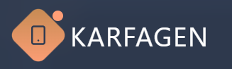

# Karfagen Website

 <!-- если есть логотип -->

---

## 📱 Описание / Description

**Русский:**  
Сайт для компании **Karfagen**, собранный на базе макета из Figma AI, который сразу предоставил готовые `.tsx` компоненты и стили. Дальнейшая разработка ведется с использованием **React**, **Vite** и **Tailwind CSS**, с постепенной адаптацией под нужды проекта.

**English:**  
Website for the company **Karfagen**, built from a Figma AI design that provided ready-made `.tsx` components and styles. The project is developed using **React**, **Vite**, and **Tailwind CSS**, gradually customized to fit the project’s needs.

---

## 🧩 Стек / Tech Stack

- **React** — фронтенд-библиотека
- **Vite** — сборщик и дев-сервер
- **Tailwind CSS** — CSS-фреймворк для стилизации
- **TypeScript** — типизация и повышение надежности кода

---
## 📁 Структура проекта / Project Structure

karfagen-website/  
├─ src/  
│  ├─ components/  # Компоненты сайта (.tsx)  
│  ├─ pages/       # Страницы сайта  
│  ├─ assets/      # изображения и другие файлы
│  └─ styles/      # Tailwind и кастомные стили  
├─ package.json  
├─ tsconfig.json  
└─ vite.config.ts  

--- 

## 👨‍💻 Контрибьютинг / Contributing

**Русский**:
Если хочешь помочь улучшить сайт — создавай форк, делай изменения и отправляй Pull Request. Любые идеи по дизайну или функционалу приветствуются.

**English**:
If you want to help improve the website — fork the repo, make changes, and submit a Pull Request. Any ideas for design or functionality are welcome.

--- 

## 📜 Лицензия / License

Apache 2.0 License  © [Atoktobekov](https://github.com/Atoktobekov)  